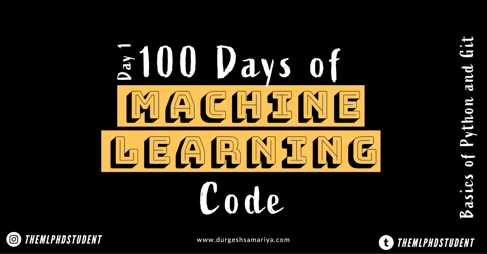
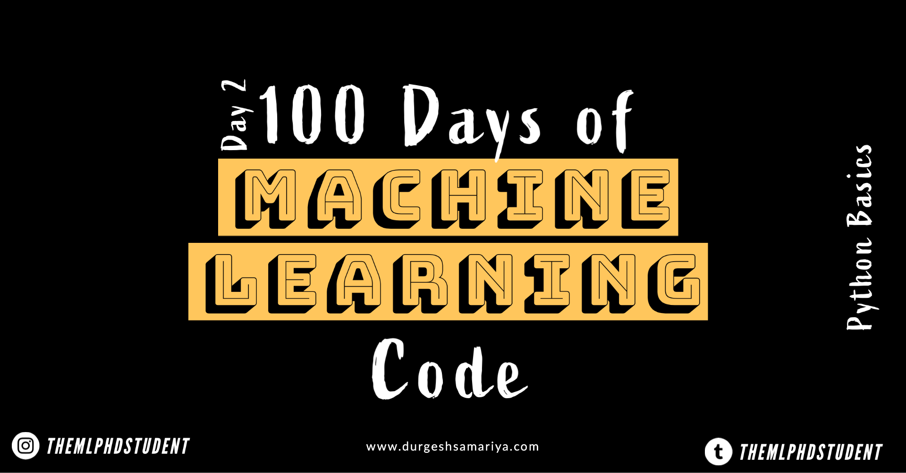

# 100DaysofMachineLearning

100-Days-Of-MachineLearning-Code

### Machine Learning 

Machine Learning is the “Field of study that gives computers the ability to learn without being explicitly programmed”. 
— Arthur Samuel , 1959

### About Challenge

I am passionate in Machine Learning (it goes without saying as I am doing my PhD in Machine Learning). One day I came across this [video](https://www.youtube.com/watch?v=cuQMBj1cWPo&t=7s) by [Siraj Raval](https://github.com/llSourcell), in which he talked about #100daysofMLcode Challenge.  I know I am bit (maybe too late) for this challenge, but better late than never.  #100daysofMLcode challenge means, studying and/or coding machine learning for minimum 1 hour a day for next 100 days.

This repository contains 100-Days-Of-Machine-Learning-Code.
In addition to that, it’s a my place to store all my machine learning self learning resources and place to track my progress.

### Motivation

By doing this challenge, I would like to learn more about Machine Learning, which is important and helpful for my research. In addition to that, at the end of 100 days, I hope to have a rich portfolio of code, projects, and summary of the machine learning topics and models plus all of the additional content (available on internet) which I’ll discover over the learning journey. I think, most importantly – as a researcher, I’d like to contribute to the machine learning community.

My aim throughout this process will be to learn as much as I can with accessible materials (mostly free) while always being sure to provide useful links that help someone wants to learn machine learning.

## Day 0 | April 11, 2020

D-Day is here and finally, I am accepting 100 days of machine learning code challenge.

On 11 Apr, 2020, I am accepting a challenge, which is “100-Days-Of-Machine-Learning-Code” and the intuition behind this to dedicate at least one hour of every day for next 100 days in studying and/or coding Machine Learning.
I will share my progress via :

GitHub: https://github.com/durgeshsamariya/100DaysofMachineLearning

Twitter : www.twitter.com/@themlphdstudent

Instagram : www.instagram.com/@themlphdstudent

My Webpage : www.durgeshsamariya.com

Medium : https://medium.com/@durgeshsamariya

You can read article [here](https://medium.com/@durgeshsamariya/100-days-of-machine-learning-code-a9074e1c42c3).

_**Make sure you subscribe and give star to repository, so you can enjoy amazing free resources.**_

## Day 1 | April 12, 2020

By starting day 1, I am taking this challenge and dedicate myself to study machine learning one hour a day till next 100 days.

I have read many self taught Machine Learning articles on web. I think first step is to pick a programming language. In my opinion, Python is the best for this. Even from my first year of PhD I am using this so I am more comfortable with Python.

But those who are new to Machine Learning, I highly recommend Python.

### Why python

- Simple and Easy
- Great community
- Great library
- Increasing popularity

### Git 

Git is version control system and GitHub is place to show your work to world.

Today I learned basics of Python ([here](hhttps://github.com/durgeshsamariya/100DaysofMachineLearning/blob/master/Day%20001/Python_Basics_1.ipynb)) and basics of Git ([here](https://github.com/durgeshsamariya/100DaysofMachineLearning/blob/master/Day%20001/Git_Basics.md)).

You can read article [here](https://medium.com/@durgeshsamariya/day-1-of-100daysofmlcode-40d3c85fbde).

## Day 2 | April 13, 2020

Today I learned more about Basic of Python ([here](https://github.com/durgeshsamariya/100DaysofMachineLearning/blob/master/Day%20002/Python_Basics_2.ipynb)).

## Day 3 | April 14, 2020

Today I learnd about OOPs concepts in Python ([here](https://github.com/durgeshsamariya/100DaysofMachineLearning/blob/master/Day%20003/OOPs%20Concepts.ipynb)).

## Day 4 | April 15, 2020

Its very productive day. Worked on NumPy library. You can find code [here](https://github.com/durgeshsamariya/100DaysofMachineLearning/blob/master/Day%20004/NumPy.ipynb). 
Tomorrow, I will work on Pandas library. I am planning to working on NumPy and Pandas alternative days.

## Day 5 | April 16, 2020

I learned basics of Pandas library. You can find code [here](https://github.com/durgeshsamariya/100DaysofMachineLearning/blob/master/Day%20005/Pandas.ipynb).

## Day 6 | April 17, 2020

Get my hands dirty in NumPy library. You can find code [here](https://github.com/durgeshsamariya/100DaysofMachineLearning/blob/master/Day%20006/NumPy.ipynb).

## Day 7 | April 18, 2020

Learned more about Pandas library. Now its time to move on different topic. I will learn more on pandas (excercise) if need. You can find code [here](https://github.com/durgeshsamariya/100DaysofMachineLearning/blob/master/Day%20006/NumPy.ipynb).

Happy Weekend.

## Day 8 | April 19, 2020
Learned advanced NumPy concepts : Liner Algebra. You can find code [here](https://github.com/durgeshsamariya/100DaysofMachineLearning/blob/master/Day%20008/NumPy.ipynb).

## Day 9 | April 20, 2020
Learned about Data handling, storage and file formate using Pandas library. You can find code [here](https://github.com/durgeshsamariya/100DaysofMachineLearning/blob/master/Day%20009/Day9.ipynb).

## Day 10 to Day 12 | April 21, 2020 to April 23,2020
I did two Covid-19 visualization project. One is effect of COVID-19 on India and another one is COVID-19 on Globe.
 Learned about web scraping, data cleaning and some visualization techniques. You can find code from [COVID-19 India](https://github.com/durgeshsamariya/Covid19India) and [Covid-19](https://github.com/durgeshsamariya/COVID19).

## Day 13 | April 24, 2020

## Day 14 | April 25, 2020

## Day 15 | April 26, 2020

## Day 16 | April 27, 2020

## Day 17 | April 28, 2020

## Day 18 | April 29, 2020

## Day 19 | April 30, 2020

## Day 20 | 

## Day 21 |

## Day 22 |

## Day 23 |

## Day 24 |

## Day 25 |

## Day 26 |

## Day 27 |

## Day 28 |

## Day 29 |

## Day 30 | 
